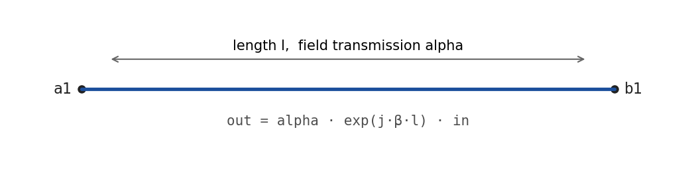
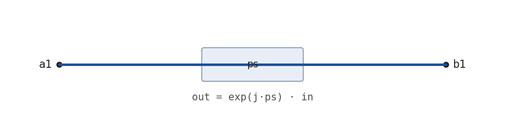
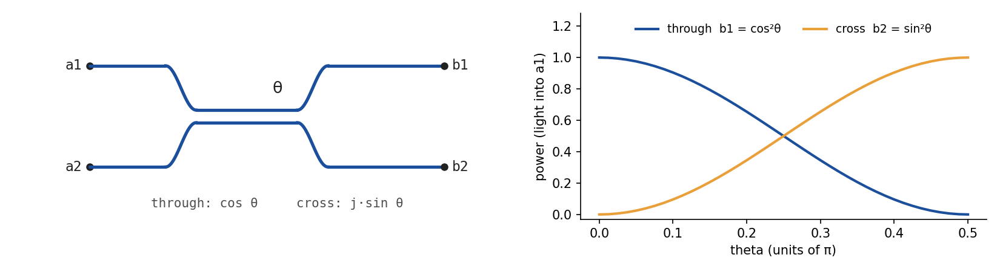
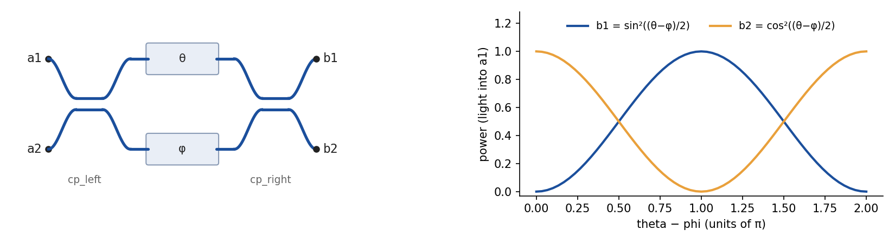
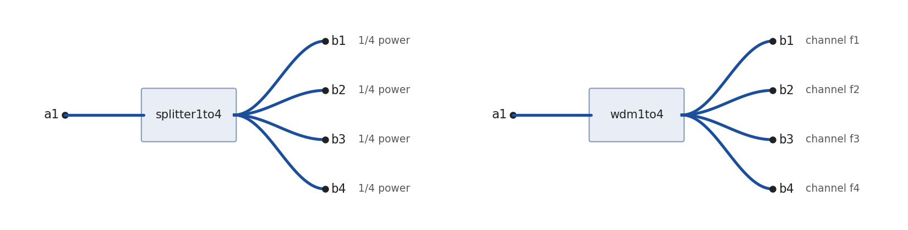
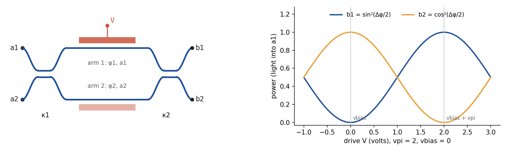
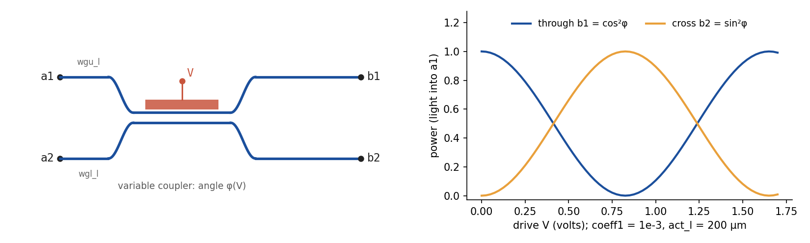
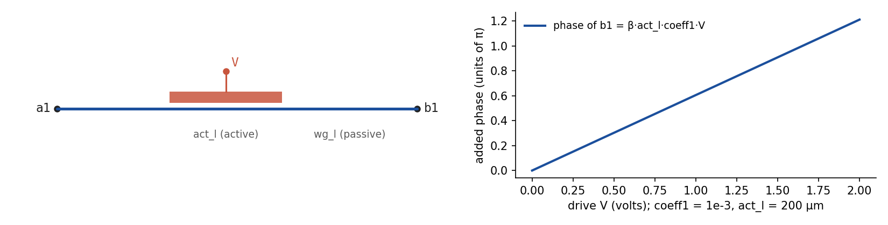
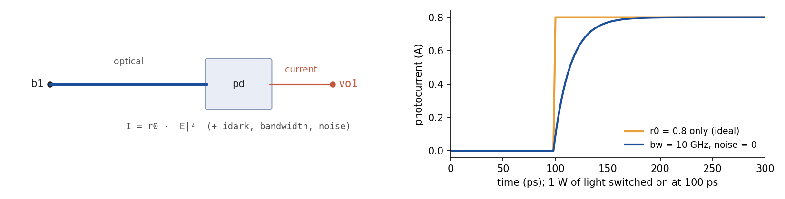

# Photonic devices

This page is a reference for every photonic device SPIPE has. For each one it shows a
picture, the netlist line, every parameter, the equations the model computes, and a small
example with numbers. [netlist.md](netlist.md) covers the rest of the netlist: directives,
units and the `.electronic` section.

| device | ports (in, out) | what it is |
|---|---|---|
| [`wg`](#wg-waveguide) | 1, 1 | waveguide: a phase and a loss |
| [`ps`](#ps-phase-shifter) | 1, 1 | fixed phase shift |
| [`mzi`](#mzi-a-directional-coupler) | 2, 2 | directional coupler (despite the name) |
| [`pbum`](#pbum-programmable-building-unit) | 2, 2 | coupler, a phase on each arm, coupler: the cell of a mesh |
| [`splitter1to1` … `splitter1to4`](#splitter1ton-power-splitter) | 1, N | ideal equal power splitter |
| [`wdm1to1`, `wdm1to2`, `wdm1to4`](#wdm1ton-wavelength-demultiplexer) | 1, N | ideal wavelength demultiplexer |
| [`mzm`](#mzm-machzehnder-modulator) | 2, 2 | push-pull Mach–Zehnder modulator (voltage driven) |
| [`modm`](#modm-voltage-driven-coupler) | 2, 2 | voltage-driven variable coupler (the paper's Eq. 5) |
| [`modp`](#modp-phase-modulator) | 1, 1 | voltage-driven phase modulator |
| [`pd`](#pd-photodetector) | 1 optical, 1 electrical | photodetector: light in, current out |

---

## Shared conventions

### The netlist line

```
<name> <optical ports> [<electrical node> <level>] [key=value ...]
```

- **The name picks the model.** The model is the longest registered prefix of the instance
  name, so `mzm0` and `mzm_tx` are both `mzm`, and `splitter1to2a` is `splitter1to2`.
- **The optical ports come first**: the input ports, then the output ports. A 2×2 device
  `mzi0 a1 a2 b1 b2` has inputs `a1`, `a2` (upper, lower) and outputs `b1`, `b2` (upper,
  lower). Two devices are connected by giving them the same node name.
- **Active devices** (`mzm`, `modm`, `modp`, `pd`) then take an **electrical node** and a
  **load level**. On a modulator the node carries the drive voltage `V`. On a detector it
  receives the photocurrent. The level is the equivalent circuit the device presents to the
  electronics, such as `level1` or `level3`. Levels only matter in a two-domain `Circuit`; see
  [Electrical load levels](netlist.md#electrical-load-levels).
- **Then `key=value` parameters**, in any order. Values accept SPICE scale factors and units:
  `l=10um`, `theta=0.25pi`, `bw=10ghz`.

### Fields and power

Each port carries a complex **field amplitude** `A` at each optical frequency of the `.freq`
grid. Its power is `|A|²`, counted in **source units**. Without a power budget on the
`.source` line, a unit is whatever you decide: `.source 1.0@a1` launches one unit, and SPIPE
never needs to know whether that is 1 W or 1 mW. The choice shows up in one place only, the
detector, which turns one unit into `r0` amperes. Reading `r0` as A/W means you took the unit to
be 1 W. With `power=`/`eff=` the unit is fixed: one unit of `|A|²` is `power·eff` watts
([The power budget](netlist.md#the-power-budget)). The examples below launch one unit and
quote output powers in units.

A device's response is written below as `b = M · a`: `a` holds the fields entering the input
ports, `b` those leaving the output ports, and `M[row, col]` maps input `col` to output `row`.
Light entering from the output side sees the transpose `Mᵀ`, so every device is reciprocal.
Each `.freq` point is solved independently of the others.

### Dispersion: the propagation constant

A section of waveguide of length `L` multiplies the field by `α · exp(j·β·L)`, with

```
β(ω) = (ω / c) · n(λ)
n(λ) = ng + (neff − ng) · λ / wl          λ = 2πc / ω
```

`n` is the effective index. It equals `neff` at the reference wavelength `wl` and has group
index `ng`. The values come from the `.mode` line: `.mode neff=2.35 ng=4.0 wl=1550nm`. If
`.mode` gives no `ng`, then `ng = neff` and the index is the same at every wavelength. `wl`
defaults to 1550 nm. A device line can override any of the three with its own `neff=`, `ng=`
or `wl=`, and the device's value wins.

`α` is the **field** transmission of the whole section, not a loss per metre. `α = 1` is
lossless, and the power transmission is `α²`. `α` only applies when the section's length is
not zero. A zero-length section is absent, and SPIPE warns if you give it an `α`. Lengths are
in metres and must not be negative.

### The coupler

Every two-waveguide coupler in SPIPE uses the same matrix, with a coupling angle `κ`:

```
C(κ) = [[ cos κ,    j·sin κ ],
        [ j·sin κ,  cos κ   ]]
```

The field that stays in its waveguide (**through**) is `cos κ`. The field that crosses over
(**cross**) is `j·sin κ`, and the `j` is the quarter-wave phase a real coupler adds. The
cross-coupled power is `sin²κ`, so `κ = π/4` is 50:50. `C(κ)` is unitary, so it loses no
light.

### Active devices: one matrix per time sample

A modulator's matrix depends on its drive `V(t)`. SPIPE builds one matrix for each time
sample from the drive at that sample (the quasi-static assumption, see
[scope.md](scope.md)). The one exception is `mzm` with `tau > 0`, which first passes the drive
through a first-order response. Passive devices have the same matrix at every sample.

---

## `wg`: waveguide



```
wg<name> <in> <out> l=<m> [alpha=<field transmission>] [neff= ng= wl=]
```

| parameter | default | unit | meaning |
|---|---|---|---|
| `l` | **required** | m | length |
| `alpha` | 1 | — | field transmission of the whole length (applies only when `l ≠ 0`) |
| `neff`, `ng`, `wl` | from `.mode` | —, —, m | mode parameters (see *Dispersion*) |

```
b1 = α · exp(j·β(ω)·l) · a1
```

The phase `β·l` also sets the delay. A waveguide of group index `ng` delays light by
`ng·l/c`, which is how rings and delay lines get their frequency response.

**Example.** `.mode neff=2.35 ng=4.0 wl=1550nm`, `.freq 193.1THz`, 1 unit into `a1`, and
`wg0 a1 b1 l=10um alpha=0.9`:

```
λ   = c / f              = 1552.524 nm
n   = 4.0 + (2.35 − 4.0) · 1552.524 / 1550 = 2.347313
β   = 2π·f · n / c       = 9.499755e6 rad/m
β·l = 94.99755 rad       ≡ 0.749769 rad  (mod 2π)
b1  = 0.9 · exp(j·0.749769) = 0.658662 + 0.613323j      |b1|² = 0.81
```

---

## `ps`: phase shifter



```
ps<name> <in> <out> ps=<rad>
```

| parameter | default | unit | meaning |
|---|---|---|---|
| `ps` | **required** | rad | the phase added (`0.5pi` is accepted) |

```
b1 = exp(j·ps) · a1
```

The phase is the same at every frequency. `ps` has no length, loss or delay. To tune a phase
with a voltage, use [`modp`](#modp-phase-modulator).

**Example.** `ps0 a1 b1 ps=0.5pi` with 1 unit into `a1` gives `b1 = j` (= `exp(jπ/2)`), still 1 unit.

---

## `mzi`: a directional coupler



The name is historical: `mzi` is **one coupler**, not an interferometer. For an
interferometer, use [`pbum`](#pbum-programmable-building-unit) (passive) or
[`mzm`](#mzm-machzehnder-modulator) (driven). `mzi` is also the coupler of a ring resonator
([Building a ring resonator](netlist.md#building-a-ring-resonator)).

```
mzi<name> <in1> <in2> <out1> <out2> theta=<rad> [l=<m> alpha=] [neff= ng= wl=]
```

| parameter | default | unit | meaning |
|---|---|---|---|
| `theta` | **required** | rad | coupling angle `κ` |
| `l` | 0 | m | length of a common propagation section on both paths |
| `alpha` | 1 | — | field transmission of that section (applies only when `l ≠ 0`) |
| `neff`, `ng`, `wl` | from `.mode` | | mode parameters, used when `l ≠ 0` |

```
[b1, b2] = α · exp(j·β·l) · C(theta) · [a1, a2]

b1 = α·e^{jβl} · ( cos θ · a1 + j·sin θ · a2 )
b2 = α·e^{jβl} · ( j·sin θ · a1 + cos θ · a2 )
```

With `l = 0` the factor `α·e^{jβl}` is 1.

**Example.** `mzi0 a1 a2 b1 b2 theta=0.3176` with 1 unit into `a1`:

```
b1 = cos 0.3176   = 0.949988        |b1|² = 0.902477  (through)
b2 = j·sin 0.3176 = 0.312287j       |b2|² = 0.097523  (cross)
```

---

## `pbum`: programmable building unit



A Mach–Zehnder interferometer with a fixed phase on each arm: a coupler, a phase `theta` on
the upper arm and `phi` on the lower, then a second coupler. A photonic mesh is tiled from
these cells.

```
pbum<name> <in1> <in2> <out1> <out2> theta=<rad> phi=<rad> l=<m> [alpha=]
           [cp_left=<rad> cp_right=<rad>] [neff= ng= wl=]
```

| parameter | default | unit | meaning |
|---|---|---|---|
| `theta` | **required** | rad | phase on the upper arm |
| `phi` | **required** | rad | phase on the lower arm |
| `l` | **required** | m | arm length; `0` is allowed |
| `alpha` | 1 | — | field transmission of the arms (applies only when `l ≠ 0`) |
| `cp_left`, `cp_right` | π/4 | rad | coupling angles of the input and output couplers (π/4 = 50:50) |
| `neff`, `ng`, `wl` | from `.mode` | | mode parameters |

```
M = α · exp(j·β·l) · C(cp_right) · diag( e^{j·theta}, e^{j·phi} ) · C(cp_left)
```

Both arms have the same length `l`, so the propagation factor is common to all four paths.
With 50:50 couplers and light entering `a1` only:

```
b1 = α·e^{jβl} · ½ · ( e^{j·theta} − e^{j·phi} )      |b1|² = α² · sin²((theta − phi)/2)
b2 = α·e^{jβl} · ½j · ( e^{j·theta} + e^{j·phi} )     |b2|² = α² · cos²((theta − phi)/2)
```

Only the difference `theta − phi` sets the split: `0` sends everything across (`a1 → b2`),
`π` everything straight through (`a1 → b1`). The common phase `(theta + phi)/2` moves the
phase of both outputs together.

**Example.** `pbum0 a1 a2 b1 b2 theta=0.5pi phi=0 l=0` with 1 unit into `a1`:

```
b1 = ½ · (j − 1)    = −0.5 + 0.5j      |b1|² = 0.5
b2 = ½j · (j + 1)   = −0.5 + 0.5j      |b2|² = 0.5
```

---

## `splitter1toN`: power splitter



```
splitter1to<N> <in> <out1> ... <outN>          N = 1, 2, 3 or 4
```

No parameters. (`neff`, `ng`, `wl` from `.mode` are accepted and unused.)

```
b_i = a1 / √N           for i = 1 … N
```

The input power is divided equally, with no phase and no loss. The reverse direction follows
from reciprocity: light entering output `i` reaches `a1` with amplitude `1/√N`. Only `1/N`
of its power arrives, as in a real Y-junction combiner, where the rest is radiated.
`splitter1to1` is a straight connection.

**Example.** `splitter1to3 a1 b1 b2 b3` with 2e-3 units into `a1` (`.source 0.0447214@a1`,
`0.0447214² = 2e-3`; 2 mW if a unit is 1 W):

```
b_i = 0.0447214 / √3 = 0.0258199        |b_i|² = 6.66667e-4      on each of b1, b2, b3
```

---

## `wdm1toN`: wavelength demultiplexer

(Figure above, right.)

```
wdm1to<N> <in> <out1> ... <outN>               N = 1, 2 or 4 (there is no wdm1to3)
```

No parameters. The `.freq` grid must have **exactly N points**, one channel per output, and
SPIPE refuses the netlist otherwise.

```
b_k(ω_n) = a1(ω_n)   if n = k,     0 otherwise
```

The `k`-th point of the `.freq` grid leaves by output `k`, with
no loss. The routing is by the channel's **position in the grid**, not by a passband: the
filter shape is ideal and does not depend on the actual frequency values.

**Example.** `.freq 193.1THz 193.2THz 2`, `.source 1.0@a1` (1 unit in each channel) and
`wdm1to2 a1 b1 b2`: `b1` carries 1 unit at 193.1 THz and nothing at 193.2 THz, and `b2` the
reverse. A `pd` on each output reads 1 A (with `r0=1`), because the detector sums over the
grid.

---

## `mzm`: Mach–Zehnder modulator



A voltage-driven interferometer: a coupler, two arms driven in push-pull, then a second
coupler. `vpi` is literally the voltage swing that takes an output from full-on to
full-off.

```
mzm<name> <in1> <in2> <out1> <out2> <drive node> <level> [vpi= vbias= il= er= chirp= tau=]
          [act_l= kappa1= kappa2= dacoeff0= dacoeff1= ... wgu_l= wgl_l= alpha=]
```

| parameter | default | unit | meaning |
|---|---|---|---|
| `vpi` | 2 | V | half-wave voltage; must be > 0 |
| `vbias` | 0 | V | the drive at which `Δφ = 0` |
| `il` | 0 | dB | insertion loss, ≥ 0 |
| `er` | ∞ | dB | extinction ratio, ≥ 0 (∞ = perfectly balanced arms; write a large number such as `er=1e9` in a netlist) |
| `chirp` | 0 | — | how the drive divides between the arms: 0 = symmetric push-pull, ±1 = one arm only |
| `tau` | 0 | s | response time of the phase; 0 = instantaneous |
| `act_l` | 1 mm | m | active length: scales the loss modulation (`dacoeff*`) and counts toward the optical delay; it adds no phase |
| `kappa1`, `kappa2` | π/4 | rad | input and output coupler angles |
| `dacoeff0`, `dacoeff1`, … | 0 | 1/m, 1/(m·V), … | drive-dependent excess power loss, a polynomial in the arm drive |
| `wgu_l`, `wgl_l` | 0 | m | extra passive length on the upper / lower arm |
| `alpha` | 1 | — | field transmission of each of those passive sections |
| `neff`, `ng`, `wl` | from `.mode` | | mode parameters, used only by `wgu_l`, `wgl_l` |

### Drive

```
u(t)        = V(t) − vbias                         (after the response, if tau > 0)
Δφ          = π · u / vpi
φ1          = +½ · (1 + chirp) · Δφ                 upper arm
φ2          = −½ · (1 − chirp) · Δφ                 lower arm
```

`φ1 − φ2 = Δφ` for every `chirp`. `chirp` only moves the common phase of the two outputs and
never changes their powers.

**Response time.** With `tau > 0` the drive reaches the phase through a first-order response:

```
τ · dΔφ/dt + Δφ = π · (V(t) − vbias) / vpi
```

SPIPE filters `u` once and derives everything else from it, phase and loss alike. It solves
the equation exactly for a drive held at `V[k]` over each interval
`(t[k−1], t[k]]`, starting from rest at the first sample:

```
u_f[0] = u[0]
u_f[k] = a_k · u_f[k−1] + (1 − a_k) · u[k]          a_k = exp(−(t[k] − t[k−1]) / τ)
```

With `tau = 0` (the default) the filter is off and `Δφ` follows the drive instantly. See
[scope.md](scope.md) for when that matters.

### Arm amplitudes: il, er and dacoeff

```
base = 10^(−il/20)
ε    = 10^(−er/20)
u1   = +½ · (1 + chirp) · u          u2 = −½ · (1 − chirp) · u        (the push-pull split)
Δα_i = dacoeff0 + dacoeff1·u_i + dacoeff2·u_i² + …                    (1/m)

a1 = base                     · exp(−½ · act_l · Δα_1)
a2 = base · (1 − ε)/(1 + ε)   · exp(−½ · act_l · Δα_2)
```

- **`il`** is a common loss. With `er = ∞` the peak power transmission is exactly
  `10^(−il/10)`.
- **`er`** makes the lower arm weaker than the upper by the amplitude ratio `(1 − ε)/(1 + ε)`.
  The on/off ratio of either output is then exactly `10^(er/10)`. The imbalance costs light,
  as in a real device: the peak transmission falls to `10^(−il/10) / (1 + ε)²`.
- **`dacoeff*`** model the loss that moves with the drive, as free carriers do in silicon.
  The same push-pull split drives it, so one arm gets lossier as the other gets less lossy.
  **Passivity caveat:** with a positive `dacoeff1`, the arm driven negative gets
  `Δα_i < 0` and its amplitude rises *above* its value at bias. With `il = 0` that amplitude
  exceeds 1 and the modulator creates light. For example `dacoeff1=100` at `V = 2` gives
  `a2 = e^{+0.05} = 1.0513` and 1.005 units out for 1 unit in. SPIPE does not check this, so keep
  `il` large enough to cover it: `il ≥ 4.343 · act_l · max(−Δα_i)` dB over the drive range
  you use (0.43 dB in this example).

### Transfer matrix

With the arm fields `A_i = a_i · e^{jφ_i}`, where a passive section adds `β·wgu_l` to `φ1`
(and `β·wgl_l` to `φ2`) and multiplies `a_i` by `alpha`:

```
M = C(kappa2) · diag(A1, A2) · C(kappa1)

M[0,0] = c1·c2·A1 − s1·s2·A2          M[0,1] = j·(s1·c2·A1 + c1·s2·A2)
M[1,0] = j·(c1·s2·A1 + s1·c2·A2)      M[1,1] = c1·c2·A2 − s1·s2·A1
```

where `c_i = cos kappa_i` and `s_i = sin kappa_i`. With 50:50 couplers, equal arms (`a1 = a2 = a`)
and light entering `a1`:

```
|b1|² = a² · sin²(Δφ/2)          |b2|² = a² · cos²(Δφ/2)
```

At `V = vbias` all the light leaves by `b2`. At `V = vbias + vpi` it all leaves by `b1`.

**Example.** `.source 1.0@a1 0.0@a2` and
`mzm0 a1 a2 b1 b2 v level1 vpi=2 vbias=0.5 il=3 er=20`, driven at `V = 1.5 V`:

```
Δφ   = π · (1.5 − 0.5) / 2 = π/2          φ1 = +π/4, φ2 = −π/4
base = 10^(−3/20) = 0.707946              ε = 10^(−20/20) = 0.1
a1   = 0.707946                           a2 = 0.707946 · 0.9/1.1 = 0.579228
b1   = ½·(A1 − A2) = 0.0455085 + 0.455085j        |b1|² = 0.209173
b2   = ½j·(A1 + A2) = −0.0455085 + 0.455085j      |b2|² = 0.209173
```

This is quadrature, so both outputs are equal. The peak transmission is
`0.501187 / 1.1² = 0.414204` and the minimum `0.414204 · 0.1² = 0.00414204`, exactly 20 dB
apart.

**Example with a response time.** The same device with `vpi=2 vbias=0 tau=20ps` (no `il` or
`er`), a drive stepping from 0 to 2 V at the second sample, and 10 ps samples:
`a = e^{−10/20} = 0.606531`. The filtered drive is `0.786939 V` at 10 ps and `1.264241 V` at
20 ps, so `|b1|² = sin²(π·u_f/4)` is `0.335768` and then `0.701627`, not an instant jump to 1.

---

## `modm`: voltage-driven coupler



The modulator of the SPIPE paper (its Eq. 5), kept unchanged so published results reproduce.
It is a **variable-ratio coupler** whose angle follows the drive, not a push-pull
interferometer. Its matrix matches an `mzm` only with `φ = π/2 − Δφ/2`, so its `V_π`
differs by a factor of two, its bias point by π/2, and it has no drive-dependent loss and infinite extinction.
For a new design, `mzm` is usually the better model.

```
modm<name> <in1> <in2> <out1> <out2> <drive node> <level> coeff1=<...> [coeff0= coeff2= ...]
           [act_l=<m> wgu_l= wgl_l= alpha=] [neff= ng= wl=]
```

| parameter | default | unit | meaning |
|---|---|---|---|
| `coeff0`, `coeff1`, … | **at least one required** | 1, 1/V, 1/V², … | relative index change `Δn/neff` as a polynomial in `V` |
| `act_l` | 10 µm | m | active length |
| `wgu_l`, `wgl_l` | 0 | m | passive input sections on the upper / lower arm |
| `alpha` | 1 | — | field transmission of each passive section (applies only when its length ≠ 0) |
| `neff`, `ng`, `wl` | from `.mode` | | mode parameters |

```
φ(V, ω) = β(ω) · act_l · ( coeff0 + coeff1·V + coeff2·V² + … )
W       = diag( α_u · e^{jβ·wgu_l},  α_l · e^{jβ·wgl_l} )
M       = C(φ) · W
```

The coefficients are the **relative** index change: for `dn/dV` per volt, write
`coeff1 = (dn/dV)/neff`. `α_u` is `alpha` if `wgu_l ≠ 0` and 1 otherwise (`α_l` likewise).
The passive sections come first, before the coupler. `act_l` adds no propagation phase of its
own, only the modulation `φ`. With no passive sections and light into `a1`,
`|b1|² = cos²φ` and `|b2|² = sin²φ`. The light swaps outputs completely when
`φ = π/2`.

**Example.** `.mode neff=2.35`, `.freq 193.1THz`, 1 unit into `a1`,
`modm0 a1 a2 b1 b2 v level1 coeff1=1e-3 act_l=200um`, driven at `V = 0.5 V`:

```
β  = 2π·193.1e12 · 2.35 / c = 9.510630e6 rad/m
φ  = β · 200e-6 · 1e-3 · 0.5 = 0.951063 rad  (0.302733 π)
b1 = cos φ   = 0.580818           |b1|² = 0.337350
b2 = j·sin φ = 0.814033j          |b2|² = 0.662650
```

Full cross-over (`φ = π/2`) needs `V = 0.825811 V`.

---

## `modp`: phase modulator



```
modp<name> <in> <out> <drive node> <level> act_l=<m> coeff1=<...> [coeff0= coeff2= ...]
           [wg_l=<m> alpha=] [neff= ng= wl=]
```

| parameter | default | unit | meaning |
|---|---|---|---|
| `act_l` | **required** | m | active length |
| `coeff0`, `coeff1`, … | **at least one required** | 1, 1/V, 1/V², … | relative index change `Δn/neff` as a polynomial in `V` (as for `modm`) |
| `wg_l` | 0 | m | length of a passive section in series |
| `alpha` | 1 | — | field transmission of that section (applies only when `wg_l ≠ 0`) |
| `neff`, `ng`, `wl` | from `.mode` | | mode parameters |

```
φ(V, ω) = β(ω) · act_l · ( coeff0 + coeff1·V + coeff2·V² + … )
b1      = α · e^{jβ·wg_l} · e^{jφ} · a1
```

The modulator changes only the phase, so the power is unchanged, apart from `α²` when
`wg_l ≠ 0`. As in `modm`, `act_l` adds only the modulation phase. The propagation phase
`β·act_l` is left out, and `wg_l` adds it back if you need it.

**Example.** `.mode neff=2.35`, `.freq 193.1THz`, 1 unit into `a1`,
`modp0 a1 b1 v level1 coeff1=1e-3 act_l=200um wg_l=5um alpha=0.95`, driven at `V = 1 V`:

```
φ       = 9.510630e6 · 200e-6 · 1e-3 · 1 = 1.902126 rad  (0.605466 π)
β·wg_l  = 47.553152 rad
b1      = 0.95 · exp(j·(1.902126 + 47.553152)) = 0.654883 − 0.688207j     |b1|² = 0.9025
```

---

## `pd`: photodetector



A detector turns the light at an optical node into a current on an electrical node. It
absorbs the light, so it must sit on an **output**, a node with just one device. To look at a
field inside a circuit without disturbing it, use `.prob`.

```
pd<name> <optical node> <electrical node> <level> r0=<A per unit> [r1= r2= ... wl=]
         [bw=<Hz> idark=<A> noise=<0|1> temp=<K> rload=<Ω> inoise=<A/√Hz> coherent=<0|1> dt=<s>]
```

| parameter | default | unit | meaning |
|---|---|---|---|
| `r0` | **required** | A per unit `|A|²` | responsivity (A/W if a unit is 1 W) |
| `r1`, `r2`, … | 0 | `r0`'s unit per (rad/s)^k | slope, curvature, … of the responsivity with frequency |
| `wl` | — | m | reference wavelength of `r1`, `r2`, …; needed with them |
| `bw` | none (infinite) | Hz | 3 dB bandwidth of a single-pole response; also switches on the noise |
| `idark` | 0 | A | dark current |
| `noise` | 1 | — | `0` keeps `bw` but drops the noise |
| `temp`, `rload` | 300, 50 | K, Ω | temperature and resistance of the thermal-noise term (a noise parameter only, not the actual load) |
| `inoise` | — | A/√Hz | input-referred current-noise density of the front end; replaces the `temp`/`rload` term |
| `coherent` | 0 | — | `1` sums the frequency channels in field, so their beat notes reach the current |
| `dt` | — | s | sample interval, used only when the run provides no time axis |

### Responsivity

```
R(ω) = r0 + r1·(ω − ω0) + r2·(ω − ω0)² + …        ω0 = 2πc / wl
```

`R` is a Taylor series in **angular** frequency about `ω0`, so `r1` is tiny: 1e-16 A/W per
rad/s (with a unit of 1 W) is already a steep slope. Without `wl`, `R = r0` at every frequency. A negative `R` at a
simulated frequency gives a warning. `r0` is in amperes per unit of `|A|²`: A/W if you take a unit as 1 W, or amperes per
`power·eff` watts when the `.source` line sets a power budget.

### Photocurrent

```
x(t) = Σ_n R(ω_n) · |A(ω_n, t)|²                                       coherent=0 (default)
x(t) = | Σ_n √R(ω_n) · A(ω_n, t) · exp(−j·(ω_n − ω_ref)·t) |²          coherent=1, ω_ref = mean of the grid
```

The default adds the channels' powers, which is right for independent WDM carriers whose beat
notes lie outside the detector bandwidth. `coherent=1` keeps the beats. Use it with a `bw` and
a time step that resolves the channel spacing.

**Bandwidth.** With `bw`, `x` passes through a single pole of time constant
`τ = 1/(2π·bw)`. The pole is solved exactly for a signal held at `x[k]` over each interval
`(t[k−1], t[k]]`, starting from rest at the first sample:

```
y[0] = x[0]
y[k] = a_k · y[k−1] + (1 − a_k) · x[k]          a_k = exp(−(t[k] − t[k−1]) / τ)
I[k] = y[k] + idark + n[k]
```

Without `bw`, `y = x`: infinite bandwidth, and no noise.

### Noise

With `bw` given and `noise=1`, `n[k]` is shot noise plus thermal noise. Both are white at the
diode, with one-sided density

```
S = 2q · (y + idark)  +  4kT / rload        A²/Hz      (or inoise² in place of 4kT/rload)
```

and they pass through the same pole as the signal. The output noise therefore has variance

```
σ² = S · (π/2) · bw                  (π/2)·bw = the noise bandwidth of a single pole
```

SPIPE draws the samples of that filtered noise exactly, so neighbouring samples are
correlated the way the real filtered noise is:

```
n[0] = σ[0] · w[0]
n[k] = a_k · n[k−1] + √(1 − a_k²) · σ[k] · w[k]          w ~ N(0, 1)
```

`noise=0` removes `n` and keeps the bandwidth. The noise comes from a private generator
seeded from `config['seed']`, so a run is reproducible. The electronic side adds no noise of
its own. [Photodetector bandwidth and noise](netlist.md#photodetector-bandwidth-and-noise)
covers seeds and Monte Carlo.

**Example.** 1e-3 units on a detector with `r0=0.8 bw=10GHz idark=10nA` (default `temp=300`,
`rload=50`). Taking a unit as 1 W, that is 1 mW on a 0.8 A/W detector:

```
I     = 0.8 · 1e-3 + 10e-9               = 800.01 µA   (mean, once settled)
S     = 2q·800.01e-6 + 4k·300/50         = 2.56351e-22 + 3.31356e-22 = 5.87707e-22 A²/Hz
σ²    = 5.87707e-22 · (π/2) · 10e9       = 9.23168e-12 A²
σ     = 3.03837 µA                        I/σ = 263.3
```

A simulated record of 20 000 samples at 1 ps gives a standard deviation of 3.02 µA.

### Load levels

The `level` token selects the equivalent circuit the detector presents to the electronics.
For example, `level1` is the photocurrent into 2 fF through a 1 kΩ series resistor, and
`level2` is a junction behind an ideal amplifier. You can register your own, such as a real
TIA. Levels matter only in a two-domain `Circuit`; see
[Electrical load levels](netlist.md#electrical-load-levels).
