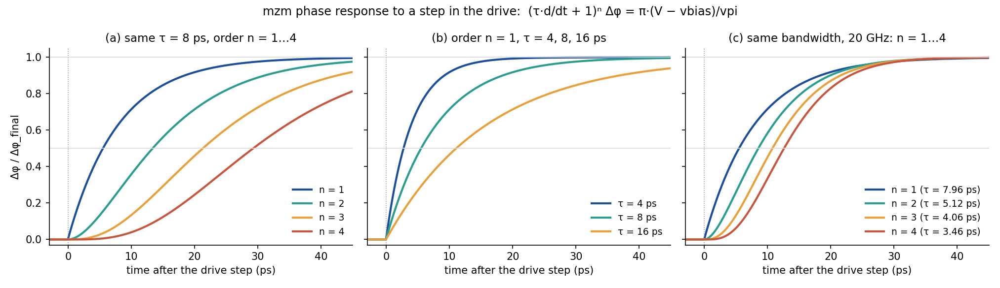

# Scope: what SPIPE models, and where it stops

SPIPE's core formulation is exact. This document states precisely where the *physics*
assumptions bind, so you can tell whether a given circuit is inside the valid regime.

## The core is exact

For a photonic circuit with `N_p` ports, SPIPE associates two unknowns with every port —
one wave in each direction — and assembles one linear constraint per device port
(`out = S · in`) plus one boundary condition per dangling node. The resulting system is
square by construction and is solved directly.

Two consequences worth stating:

- **Loops are handled exactly.** The direct solve sums the infinite series of round trips,
  so a recirculating mesh needs no iteration and no truncation.
- **Energy is conserved to solver precision.** On a lossless network — including one with
  optical feedback — total detected power equals injected power to machine zero in
  `complex128`.

The gradient is likewise exact: differentiating `A x = b` gives `dx/dθ = −A⁻¹ (dA/dθ) x`,
which matches central finite differences to ~1e-10 in double precision.

## Assumption 1: the modulator responds instantly

Stated in the paper. A drive `v(t)` produces phase `φ(t)` with no transient. Valid when the
modulator's own response time is far shorter than the drive's timescale — true for
free-carrier plasma dispersion (~0.1 ps) against a 10 Gsps DAC (100 ps).

**Lifted by:** the `mzm` model's `tau=` parameter, which gives the phase a first-order
(or `order=n` cascaded) lag. `tau=0` reproduces the instantaneous result bit-for-bit.

### The equations

**First order (`order=1`, the default when `tau` is set).** The phase difference between the
two arms, `Δφ`, follows the drive through a single lag with time constant `τ`:

```
τ · dΔφ/dt + Δφ = π · (V(t) − vbias) / vpi
```

After a step in the drive, `Δφ` covers 63 % of the way in one `τ`, 95 % in `3τ` and over 99 %
in `5τ`.

**Instantaneous (`tau=0`, the default).** With `τ = 0` the equation reduces to

```
Δφ(t) = π · (V(t) − vbias) / vpi
```

The phase follows the drive at once. This is the model used most often, including in the
paper (its Assumption 1). It is accurate whenever the drive changes slowly compared with the
modulator's response.

**General order (`order=n`).** The drive passes through `n` identical lags in a row, each
feeding the next:

```
y₀ = π · (V(t) − vbias) / vpi
τ · dyᵢ/dt + yᵢ = yᵢ₋₁,      i = 1, 2, …, n
Δφ = yₙ
```

Equivalently, as one equation in the derivative operator `D = d/dt`:

```
(τ·D + 1)ⁿ Δφ = π · (V(t) − vbias) / vpi
```

For `n = 1` this is the first-order equation above; for `n = 2` it is
`τ²·Δφ'' + 2τ·Δφ' + Δφ = π·(V − vbias)/vpi`.
- **Frequency response:** `H(s) = 1/(1 + sτ)ⁿ`. The 3 dB bandwidth is
  `f_3dB = √(2^(1/n) − 1) / (2πτ)`, and the response falls at 20·`n` dB per decade above it.
- **Step response:** `1 − e^(−t/τ) · Σ_{k=0}^{n−1} (t/τ)^k / k!`.

The lag is applied to `V − vbias` before anything else. The loss modulation (`dacoeff*`) follows
the lagged drive too, as carrier density does in a real device.



*Each curve is computed by SPIPE's own modulator model and checked against the step response
above. The script is [`figures/make_modulator_lag.py`](figures/make_modulator_lag.py).*

- **(a) Same `τ`, higher order:** every added stage delays and slows the response, so the
  bandwidth drops.
- **(b) Order 1, larger `τ`:** the same shape, stretched in time.
- **(c) Same bandwidth (20 GHz), higher order:** this is the comparison that matters when
  matching a device. Order 1 starts at full speed the instant the drive changes, then creeps
  toward its final value. A higher order starts gently, rises more steeply in the middle and
  settles in a similar time.

**When is `order > 1` worth it?** Rarely. `tau` alone captures the main physics: a finite
modulator bandwidth. A higher order changes the steepness, in two senses:
- in frequency, a faster roll-off above the bandwidth;
- in time, the S-shaped edge of panel (c).

This matters only when the drive's bit rate approaches the modulator's bandwidth and you want
the eye shape and the inter-symbol interference right, typically when fitting a measured
response that falls faster than 20 dB per decade. Otherwise leave `order=1`.

**On the time grid.** SPIPE applies each lag on the `.tran` samples. The drive value at sample
`k` is taken to hold over the whole interval before it:

```
a_k = exp(−(t_k − t_{k−1}) / τ)
yᵢ[k] = a_k · yᵢ[k−1] + (1 − a_k) · yᵢ₋₁[k],     yᵢ[0] = yᵢ₋₁[0],     i = 1 … n
Δφ[k] = yₙ[k]
```

The run therefore starts settled at its first drive value.
- **`n = 1`:** the result is exact, apart from leading the continuous response by one sample.
- **`n ≥ 2`:** each later stage sees a sampled input, so the result is accurate to about
  `0.2–0.35·Δt/τ` for `n = 2…4` (measured).

Use samples several times finer than `τ` to see the shape of an edge, not just its effect on
the samples.

### Choosing `τ` and `order`

`τ` sets the modulator's electro-optic bandwidth. For a single lag,

```
f_3dB = 1 / (2π τ)        i.e.   τ = 1 / (2π f_3dB)
```

| modulator bandwidth | `tau=` (with `order=1`) |
|---|---|
| 10 GHz | `15.9p` |
| 20 GHz | `7.96p` |
| 40 GHz | `3.98p` |
| free-carrier limit, ~0.1 ps | effectively `0`: keep the default |

With `order=n`, the same `τ` gives a lower bandwidth,
`f_3dB = √(2^(1/n) − 1) / (2π τ)`. For example, `tau=8p` gives 19.9 GHz with `order=1` and
12.8 GHz with `order=2`. Pick `n` to match the steepness of a measured frequency response,
then `τ` to match its 3 dB point. When the modulator's bandwidth is set mainly by its RC
(the driver charging the junction), model that on the electrical side instead, with the
`level3` load. `tau=` is for the optical response of the device itself.

### Reduced cases

**The default `mzm`** has `tau=0`, `chirp=0`, 50:50 couplers, `il=0`, `er` infinite and no
loss modulation. For light entering the first input, it reduces to

```
first output  (bar):    sin²(Δφ / 2)
second output (cross):  cos²(Δφ / 2),        Δφ = π · (V − vbias) / vpi
```

At `V = vbias` all the light leaves by the second output; at `V = vbias + vpi`, by the first.
`vpi` is exactly the swing from full-on to full-off.

**The paper's case.** The paper's decks use `modm`, its Eq. 5: a variable-ratio coupler whose
angle is set by the drive. It responds instantly: `modm` has no `tau=`, and Assumption 1 holds
exactly. Its phase is a polynomial in the drive:

```
φ(V) = β · act_l · (coeff0 + coeff1·V + coeff2·V² + …),     β = 2π · neff · f / c
first output  (through):  cos²(φ)
second output (cross):    sin²(φ)
```

With the paper's values, `coeff1 = 1e-3`, `act_l = 200 µm`, `neff = 2.35` and `f = 193.5 THz`:
`φ = 1.906 rad/V · V`. The light moves fully to the cross port at `V = 0.824 V`, and at 0.3 V
71 % stays in the through port. The paper's time steps (nanoseconds, a 0.1 Gsps DAC) are far
longer than any free-carrier response (~0.1 ps), which is why the instantaneous model is
accurate there. To give that switch a finite speed, model it with `mzm` and `tau=` instead.
Note that `modm` and `mzm` differ in `V_π` by 2× and in bias point by π/2 (see
[netlist.md](netlist.md)).

## Assumption 2: the photonic network settles instantly

**Not stated in the paper, and it is the one that actually binds.**

Because the network is solved in *steady state* at every time sample, SPIPE implicitly
assumes every optical transit and round-trip time is negligible against the modulation
timescale. Concretely, a 250 µm waveguide at `ng = 4` is 3.3 ps one way; a 3×3 mesh round
trip is tens of ps. At 0.1 Gsps (10 ns/sample) there is ~1000× margin. At 10 Gb/s it is
10–50 % of a bit. A high-Q ring has a photon lifetime of nanoseconds.

The failure mode is **structural, not gradual**. With zero optical memory there is no
delay, so resonator ring-up, delay-set oscillation and pattern-dependent ISI are not
approximated badly — they are absent from the model.

**Guarded by:** `Photonic.check_quasistatic(dt)`, which warns, with both numbers, when the
network's delay exceeds `0.1·dt`. It uses the larger of two estimates: the longest light path
(delay lines, meshes), and the group delay `dφ/dω` measured at the simulated carriers. The
second one is what sees a resonator, whose photon lifetime is its round trip times its
finesse — on a high-Q ring, 2.2 ns where the path length alone suggests 1.7 ps. Disable with
`config['quasistatic_check'] = False`.

**Lifted by:** `simulate(..., mode='envelope')`. The passive sub-network is linear and
time-invariant, so its transfer `H(ω)` over the `.freq` band is computed once and inverse-
FFT'd into an impulse response; the detected field is then a convolution, so light arriving
at time `t` carries the modulator state from `t − τ`. This upgrades the assumption from
*"optical memory is zero"* to *"optical memory is short compared with how fast the
modulator changes"*.

Envelope mode requires a `.freq` grid wide enough (`band ≫ 1/dt`) and fine enough
(`1/(2·df) ≫ τ_max`); it warns with concrete numbers when either is violated.
It is differentiable with respect to the **modulator drive**: `backward()` through an
envelope-mode result fills in `drive.grad`, matching finite differences to `4e-09`. It also works
inside a `Circuit` (`simulate(mode='envelope')`), including gradients with respect to
`.sensparam` parameters. It is not yet differentiable with respect to *passive* device
parameters (a waveguide length, a coupler angle); use `mode='quasistatic'` for those. How to
size the grid, which carrier to read, and the settings are in [envelope.md](envelope.md).

### A known limitation: modulators inside optical loops

Envelope mode represents a delay shorter than the time step with a fractional-delay kernel.
Inside a feedback loop — **a modulator inside a ring**, say — that kernel can act as gain at
some carriers, and the calculation goes unstable. The ring's own physics is fine (the
steady-state solve is exact); the time-domain method is what fails. Measured on a ring with a
1.68 ps round trip: at 1 ps steps the output grew to 464× the input power; at 2 ps steps the
centre carrier looked fine while carriers across the band reached 10¹⁵×.

SPIPE checks for this rather than returning such numbers:

- **Runaway** is an error. If, at the end of the record, the detected power is more than ten
  times both the launched power and the circuit's own steady-state output, the run raises.
  (A resonator *can* briefly emit more than it receives — it releases stored energy when the
  input changes — so the test is runaway growth, not instantaneous power.)
- **Failure to settle** is a warning. Once the drive has been constant for longer than the
  network's memory, the result must equal the quasi-static steady state; if it differs by more
  than 0.1 %, SPIPE says so, with the size of the discrepancy.

Modulators *outside* a loop — driving a ring from outside, or feeding a delay line — are the
case envelope mode is built for, and they are unaffected.

## Assumption 3: the frequency axis is incoherent channels

The photodetector sums `|p(ω_n)|²` over the `.freq` grid. That is correct when those
points are independent WDM carriers whose beat notes fall outside the detector bandwidth.
It is **wrong** if you read the grid as the Fourier decomposition of one modulated signal,
where the cross terms *are* the signal.

**Made explicit by:** the `coherent=` option on the `pd` line, which squares the summed
field and low-passes at the detector bandwidth `bw`, so the two regimes are one formula.
The default preserves the incoherent behaviour.

`coherent=1` needs a transient time axis: the drive's, or on a circuit with no modulator, the
`t` you pass to `Photonic(...).simulate(t)`. Without `bw=` there is no low-pass, and the
detector returns the raw beat, sampled at your time step. It is aliased if the step is coarser
than `1/(2·Δf)` for the carriers' spacing `Δf`. Give `bw=` for a real detector. Two properties
are worth knowing before you read the output:

- The reduction to the incoherent sum is **asymptotic, not exact**. A single-pole filter
  rejects a beat note at `Δf` by roughly `bw / Δf`, so carriers 500× above the bandwidth
  leave about 1.7 % ripple — measured at 2.5e-2 A on a 1.5 A photocurrent.
- The low-pass starts from the **first sample**, and at `t = 0` every carrier is in phase
  by construction, so the coherent photocurrent starts at its fully constructive value
  (4.5 for three unit channels, against a steady state of 1.5) and decays toward the
  incoherent value with the detector's own time constant `τ = 1/(2π·bw)`. Discard the
  first few `τ`, or start the record earlier than the window you care about.

`test/tb/tb03_oe_interface.py` pins both, and also pins that `Photonic` hands the detector
its time axis at all: before that was wired up, `bw=` and `coherent=` were accepted, warned
once, and silently fell back to an unfiltered incoherent sum.

## A worked demonstration of the boundary

`examples/oeo_optical_delay.py` builds an optoelectronic oscillator whose frequency is set
by a 2 m optical delay line. SPIPE warns: it prints the group delay (15.68 ns), the time step
(25 ps) and their ratio (627). The example then stops rather than simulate, explaining that the
frequency-selective element is structurally absent from the quasi-static model, and points at
`mode='envelope'`. It reports no oscillation frequency, because any number the default mode
produced would be meaningless. The library does not stop you: a warning is all it gives, and
`Circuit.simulate()` on that netlist runs and returns such a number.

That is the intended behaviour: a simulator should decline rather than return a plausible
wrong answer.
