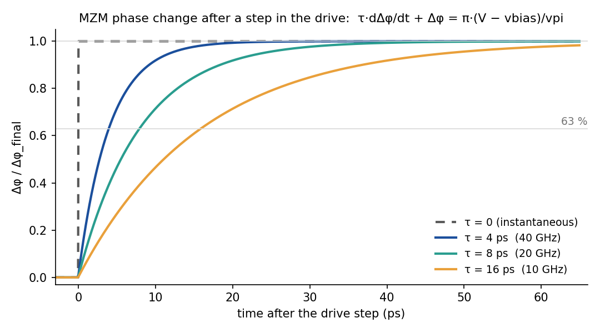
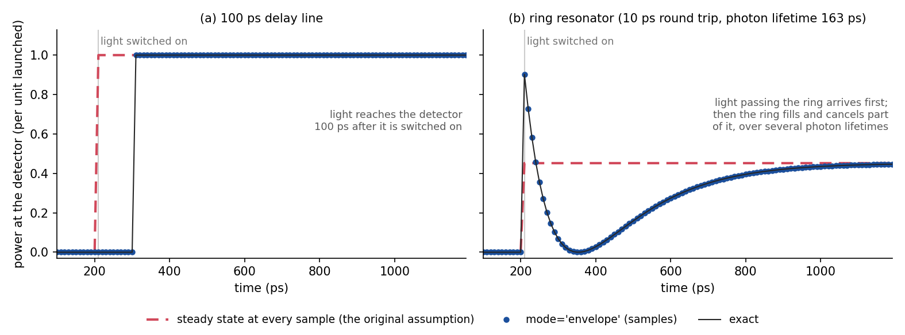

# Scope: what SPIPE models, and where it stops

This document states precisely where the *physics* assumptions bind, so you can tell whether a
given circuit is inside the valid regime.

## Assumption 1: the modulator responds instantly

Stated in the paper. A drive `v(t)` produces phase `φ(t)` with no transient. Valid when the
modulator's own response time is far shorter than the drive's timescale — true for
free-carrier plasma dispersion (~0.1 ps) against a 10 Gsps DAC (100 ps).

**Resolved by:** the `mzm` model's `tau` parameter, which gives the modulator a finite
response time. With it the modulator model differs from the one in the original paper.
`tau=0` (the default) reproduces the paper's instantaneous model bit for bit.

### The equations

**With a response time (`tau > 0`).** The phase difference between the two arms, `Δφ`,
follows the drive with a first-order response of time constant `τ`:

```
τ · dΔφ/dt + Δφ = π · (V(t) − vbias) / vpi
```

After a step in the drive, `Δφ` covers 63 % of the way in one `τ`, 95 % in `3τ` and over 99 %
in `5τ`.

**Instantaneous (`tau=0`, the default).** With `τ = 0` the equation reduces to

```
Δφ(t) = π · (V(t) − vbias) / vpi
```

The phase follows the drive at once. This is the model used most often, including in the
paper (its Assumption 1). It is accurate whenever the drive changes slowly compared with the
modulator's response.

The response is applied to `V − vbias` before anything else, and the loss modulation
(`dacoeff*`) follows the same filtered drive, as carrier density does in a real device.



### Choosing `τ`

`τ` sets the modulator's electro-optic bandwidth:

```
f_3dB = 1 / (2π τ)        i.e.   τ = 1 / (2π f_3dB)
```

| modulator bandwidth | `tau=` |
|---|---|
| 10 GHz | `15.9p` |
| 20 GHz | `7.96p` |
| 40 GHz | `3.98p` |
| free-carrier limit, ~0.1 ps | effectively `0`: keep the default |

### Why a modulator responds slowly, and how SPIPE models each cause

A modulator's optical output can trail its drive signal for two separate reasons.

1. **The voltage reaches the device slowly (electrical).** Electrically, a modulator is a
   capacitor: its pn junction (a few hundred fF) plus its contact pad. The driver has to
   charge that capacitance through resistance: its own output resistance plus the modulator's
   series resistance. So when the driver switches, the voltage across the junction does not
   jump; it rises gradually, with a time constant of about `R·C`. For example, 110 Ω and
   220 fF give 24 ps, a bandwidth near 6.6 GHz. A stronger driver (a wider transistor) has
   less resistance and charges the junction faster.
2. **The device reacts slowly even to an instant voltage change (physical).** When the
   junction voltage changes, the charge carriers inside have to move before the refractive
   index, and so the optical phase, can follow. In a depletion-mode silicon modulator this
   takes well under a picosecond. In a carrier-injection modulator it takes about a
   nanosecond, the lifetime of the carriers.

**The `tau` parameter above handles the second cause.** It sets how quickly the optical phase
follows the voltage that actually arrives at the device.

**The first cause is handled in the electronic circuit.** An active device's netlist line
ends with an electrical load level, for example `mzm0 a1 a2 b1 b2 vdrv level3 ...`. The
level chooses the equivalent circuit that SPIPE connects to the drive node in the electronic
simulation. `level3` is a realistic modulator load: a 10 Ω series resistance, a 200 fF
junction and a 20 fF pad (see "Electrical load levels" in [netlist.md](netlist.md)). The
electronic simulator then really has to charge that capacitance. The voltage it passes to the
modulator is already slowed by the RC, and how much depends on the driver circuit you
designed. This is also what makes the gradient with respect to a transistor width
meaningful: a wider driver charges the modulator faster, and the optical output shows it.

**Setting the two parts from measurements.** A measured step or frequency response shows the
two causes combined, and one curve alone cannot say which part is which. Separate them by
measuring the electrical side on its own, then attribute only what is left to the device:

1. **Electrical part first.** Measure the modulator's electrical reflection (S11) with a
   network analyser at your operating bias, or take its capacitance and series resistance from
   the datasheet. Fit the load's equivalent circuit to it, and write the values on the device
   line: `mzm0 a1 a2 b1 b2 vdrv level3 cj=300f rs=20 cpad=20f ...`. These parameters go to the
   electronic circuit. For a different circuit topology, register your own load level (see
   [netlist.md](netlist.md)).
2. **Predict the electrical bandwidth.** With `tau=0`, simulate the modulator driven by the
   source used in the optical measurement, usually a 50 Ω source, and read off its bandwidth,
   `f_RC`.
3. **Compare with the measured electro-optic bandwidth `f_EO`** (the S21 from drive voltage to
   optical modulation, or the datasheet figure).
   - If `f_EO ≈ f_RC`, the modulator is RC-limited: keep `tau=0`. This is typical of
     depletion-mode silicon modulators.
   - If `f_EO` is clearly lower, the device adds its own response. A rough estimate is
     `1/f_dev² ≈ 1/f_EO² − 1/f_RC²`, then `tau = 1/(2π·f_dev)`. For an exact split, divide
     the measured S21 by the RC response and fit a single pole to what remains.
4. **With only a datasheet bandwidth:** for a depletion-mode modulator, assume it is
   RC-limited and adjust `cj` until the simulated bandwidth with a 50 Ω source matches. For a
   carrier-injection modulator, whose carriers are the slow part, use `tau` alone.

Do not put the whole measured bandwidth into `tau` on top of a realistic load: that models the
same slowness twice. Splitting it this way also keeps the model right when the driver
changes, which is the point of simulating the driver at all. A single `tau` fitted to the
total bandwidth is right only for the driver it was measured with.

## Assumption 2: the photonic network settles instantly

The paper does not state this assumption, but it is the one that limits SPIPE most.

### What the assumption says

At every time sample, SPIPE solves the photonic network in **steady state**: it takes the
modulator settings at that instant and finds the fields that would exist if they had been held
forever. So light is assumed to cross the whole network, and every resonator to fill up, in no
time at all. The next sample is solved afresh, with no memory of the last one.

Light does take time. A 250 µm waveguide at `ng = 4` takes 3.3 ps to cross, and a round trip
through a 3×3 mesh takes tens of ps. A resonator holds light for many round trips: a high-Q
ring's photon lifetime is nanoseconds, even though one trip around it is about a picosecond.
Whether that matters depends on the time step:

- at 0.1 Gsps (10 ns per sample), 3.3 ps is about 1/3000 of a sample, and the assumption holds;
- at 10 Gb/s (100 ps per bit), tens of ps of delay is 10–50 % of a bit, and it does not.

### What goes wrong when it does not hold

The error is not a small inaccuracy. Effects that depend on delay are simply **missing** from
the result. The figure shows two circuits in which a modulator switches the light on at 210 ps.



- **(a) A 100 ps delay line.** The light reaches the detector 100 ps after it is switched on.
  The steady-state solve (red) shows it arriving at once.
- **(b) A ring resonator** next to the waveguide, with a 10 ps round trip and a 163 ps photon
  lifetime. In reality the light that passes the ring arrives first, at almost full power. Then
  the ring fills and its light cancels part of the passing light, and the output settles over
  several photon lifetimes. The steady-state solve jumps straight to the final value, so the
  whole transient is missing.

For the same reason, a steady-state solve cannot show intersymbol interference from optical
memory, or oscillation in a loop whose delay sets its period.

### What SPIPE now does about it

**1. It warns you.** On the first `simulate()`, SPIPE estimates the network's optical delay and
warns, giving both numbers, when that delay is more than `0.1·dt`. It takes the larger of two
estimates:
- the longest light path, which catches delay lines and meshes;
- the group delay `dφ/dω` measured at the simulated carriers, which catches resonators. A
  path length cannot see a photon lifetime: on a high-Q ring the path gives 1.7 ps, but the
  lifetime is 2.2 ns.

Call `Photonic.check_quasistatic(dt)` to run the check yourself. If your time axis is not
physical (a DC sweep, say), turn it off with `config['quasistatic_check'] = False`.

**2. It can model the delay: `simulate(..., mode='envelope')`.** The idea has three steps:
- The passive part of the circuit (waveguides, couplers, rings, meshes) is linear and does not
  change in time. So its response can be computed once, at every frequency of the `.freq`
  grid.
- The inverse Fourier transform turns that frequency response into an **impulse response**:
  how much light reaches the output a given time after it entered.
- The light from the modulators is **convolved** with that impulse response. Light reaching a
  detector at time `t` therefore carries the modulator state from earlier times, which is the
  memory the steady-state solve leaves out.

In the figure the envelope result (blue dots) matches the exact answer at every sample. Once the
drive stops changing, it settles to exactly the steady-state value. The assumption becomes
*"optical memory is short compared with how fast the modulators change"* rather than *"there is
no optical memory"*. Modulators are still treated as instantaneous, apart from their own `tau`
(Assumption 1).

**3. The `.freq` grid is checked.** Envelope mode builds the impulse response from the `.freq`
grid, so the grid has to meet two conditions, where `dt` is the time step:
- **wide enough:** the band must be several times `1/dt`;
- **fine enough:** `1/(2·df)` must be well above the circuit's memory, which is several photon
  lifetimes for a resonator.

SPIPE warns, with the numbers, when either fails. [envelope.md](envelope.md) explains how to size
the grid and which carrier to read.

**4. It works in co-simulation, with gradients.** `Circuit(...).simulate(mode='envelope')` keeps
the optical delay inside the electronic–photonic loop. `backward()` gives gradients:
- with respect to the **modulator drive**, which match finite differences to 4e-9;
- with respect to **`.sensparam` parameters**, with the optical delay included in the
  derivative.

It is not yet differentiable with respect to *passive* photonic parameters, such as a waveguide
length or a coupler angle. Use the default mode for those.

| | the original solver | SPIPE now |
|---|---|---|
| optical delay | not modelled, with no warning | warns when the delay is more than 0.1·dt, including a resonator's photon lifetime |
| delay line, ring transient | absent: the output jumps to its final value | `mode='envelope'` reproduces them, and matches the exact answer in the figure |
| electronic–photonic loop | no delay in the loop | envelope mode inside `Circuit`, with the delay in the loop |
| gradients | steady state only | also through envelope mode: modulator drive and `.sensparam` (not passive parameters) |
| checks on the result | none | `.freq` grid sizing, runaway, and failure to settle (below) |

### A known limitation: modulators inside optical loops

Envelope mode represents a delay shorter than the time step with a fractional-delay kernel.
Inside a feedback loop — **a modulator inside a ring**, say — that kernel can act as gain at
some carriers, and the calculation goes unstable. The ring's own physics is fine (the
steady-state solve is exact); the time-domain method is what fails. Measured on a ring with a
1.68 ps round trip: at 1 ps steps the output grew to 464× the input power; at 2 ps steps the
centre carrier looked fine while carriers across the band reached 10¹⁵×.

SPIPE checks for this rather than returning such numbers:

- **Runaway** is an error. If, at the end of the record, the detected power is more than ten
  times both the launched power and the circuit's own steady-state output, the run raises.
  (A resonator *can* briefly emit more than it receives — it releases stored energy when the
  input changes — so the test is runaway growth, not instantaneous power.)
- **Failure to settle** is a warning. Once the drive has been constant for longer than the
  network's memory, the result must equal the quasi-static steady state; if it differs by more
  than 0.1 %, SPIPE says so, with the size of the discrepancy.

Modulators *outside* a loop — driving a ring from outside, or feeding a delay line — are the
case envelope mode is built for, and they are unaffected.

## Assumption 3: the frequency axis is incoherent channels

The photodetector sums `|p(ω_n)|²` over the `.freq` grid. That is correct when those
points are independent WDM carriers whose beat notes fall outside the detector bandwidth.
It is **wrong** if you read the grid as the Fourier decomposition of one modulated signal,
where the cross terms *are* the signal.

**Made explicit by:** the `coherent=` option on the `pd` line, which squares the summed
field and low-passes at the detector bandwidth `bw`, so the two regimes are one formula.
The default preserves the incoherent behaviour.

`coherent=1` needs a transient time axis: the drive's, or on a circuit with no modulator, the
`t` you pass to `Photonic(...).simulate(t)`. Without `bw=` there is no low-pass, and the
detector returns the raw beat, sampled at your time step. It is aliased if the step is coarser
than `1/(2·Δf)` for the carriers' spacing `Δf`. Give `bw=` for a real detector. Two properties
are worth knowing before you read the output:

- The reduction to the incoherent sum is **asymptotic, not exact**. A single-pole filter
  rejects a beat note at `Δf` by roughly `bw / Δf`, so carriers 500× above the bandwidth
  leave about 1.7 % ripple — measured at 2.5e-2 A on a 1.5 A photocurrent.
- The low-pass starts from the **first sample**, and at `t = 0` every carrier is in phase
  by construction, so the coherent photocurrent starts at its fully constructive value
  (4.5 for three unit channels, against a steady state of 1.5) and decays toward the
  incoherent value with the detector's own time constant `τ = 1/(2π·bw)`. Discard the
  first few `τ`, or start the record earlier than the window you care about.

`test/tb/tb03_oe_interface.py` pins both, and also pins that `Photonic` hands the detector
its time axis at all: before that was wired up, `bw=` and `coherent=` were accepted, warned
once, and silently fell back to an unfiltered incoherent sum.

## A worked demonstration of the boundary

`examples/oeo_optical_delay.py` builds an optoelectronic oscillator whose frequency is set
by a 2 m optical delay line. SPIPE warns: it prints the group delay (15.68 ns), the time step
(25 ps) and their ratio (627). The example then stops rather than simulate, explaining that the
frequency-selective element is structurally absent from the quasi-static model, and points at
`mode='envelope'`. It reports no oscillation frequency, because any number the default mode
produced would be meaningless. The library does not stop you: a warning is all it gives, and
`Circuit.simulate()` on that netlist runs and returns such a number.

That is the intended behaviour: a simulator should decline rather than return a plausible
wrong answer.
